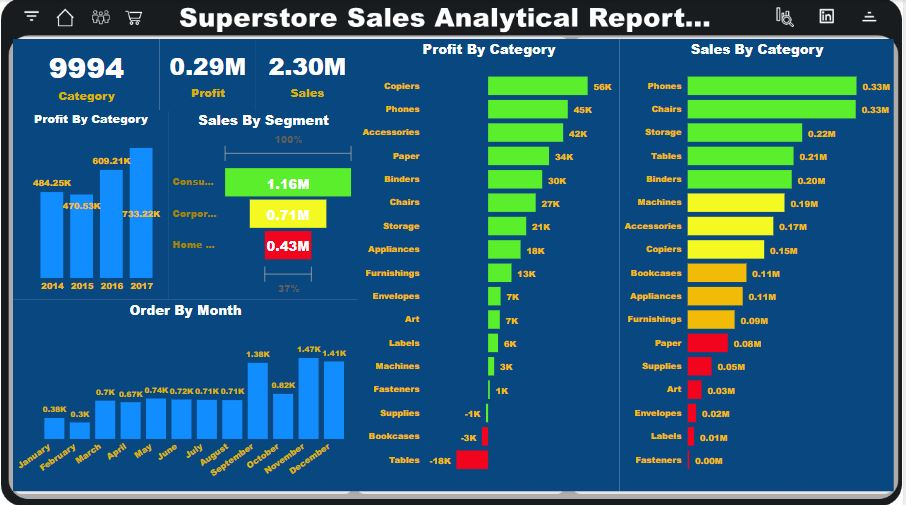

# Supper Store Analytical Report 
***
##### _The analytic dashboard deep dive into the losses and profit, provide analytical solution to mitigate losses and improve profit margine. The super store data was analyzed to address the following;_
* what are the total sales by segment.
* what are the profit and sales in different regions.
* what is the total quantity in different categories.
* what is the total sales in different categories.
* what is the total profit different categories.
* what is the sum of ship mode in terms of sales in each year
* what is the sum of ship mode in terms of quantity in each year
* what is the progress in sales, profit and quantity in each
* What is the profit sales of each year

### Tools
* PowerBi 
* Excel 
* SQL
* Power Point